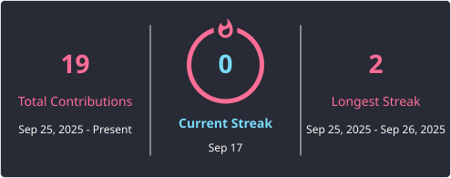

## Olá, meu nome é Helyf ✨

  
  

 

<picture>
  <source media="(prefers-color-scheme: dark)" srcset="https://raw.githubusercontent.com/avila-helyf/avila-helyf/output/github-contribution-grid-snake-dark.svg">
  <source media="(prefers-color-scheme: light)" srcset="https://raw.githubusercontent.com/avila-helyf/avila-helyf/output/github-contribution-grid-snake.svg">
  
</picture>

---

### 🌸 Sobre mim

* 💻 Atualmente trabalhando como **Analista de Implantação**
* 🎓 Estudando **Análise e Desenvolvimento de Sistemas**
* ⚙️ Gosto de trabalhar tanto com **Backend**, quanto com **Frontend**
* ❤️ Apaixonada por tecnologia

---

### 🛠️ Tecnologias & Ferramentas

  
  
  
  
  

